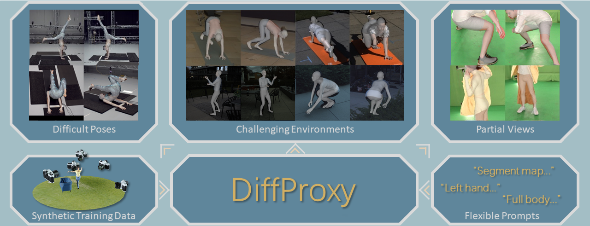

<div align="center">

# DiffProxy: Multi-View Human Mesh Recovery via Diffusion-Generated Dense Proxies

<div>
    <a href="https://wrk226.github.io/"><strong>Renke Wang</strong></a><sup>1</sup>,
    <a href="https://jessezhang92.github.io/"><strong>Zhenyu Zhang</strong></a><sup>2*</sup>,
    <a href="https://tyshiwo.github.io/"><strong>Ying Tai</strong></a><sup>2</sup>,
    <a href="https://www.patternrecognition.asia/jian/"><strong>Jian Yang</strong></a><sup>1*</sup>
</div>

<div>
    <sup>1</sup><strong>Nanjing University of Science and Technology</strong> &nbsp;&nbsp;
    <sup>2</sup><strong>Nanjing University</strong>
</div>

<div>
    <sup>*</sup><strong>Corresponding Author</strong>
</div>

<br>

[](https://arxiv.org/abs/2601.02267)
[](https://wrk226.github.io/DiffProxy.html)

<br>

</div>

## 🚧 Code
The code will be released after the paper is accepted.

## 📚 BibTeX
```bibtex
@article{wang2025diffproxy,
  title={DiffProxy: Multi-View Human Mesh Recovery via Diffusion-Generated Dense Proxies},
  author={Wang, Renke and Zhang, Zhenyu and Tai, Ying and Yang, Jian},
  journal={arXiv preprint	arXiv:2601.02267 },
  year={2025}
}
```
